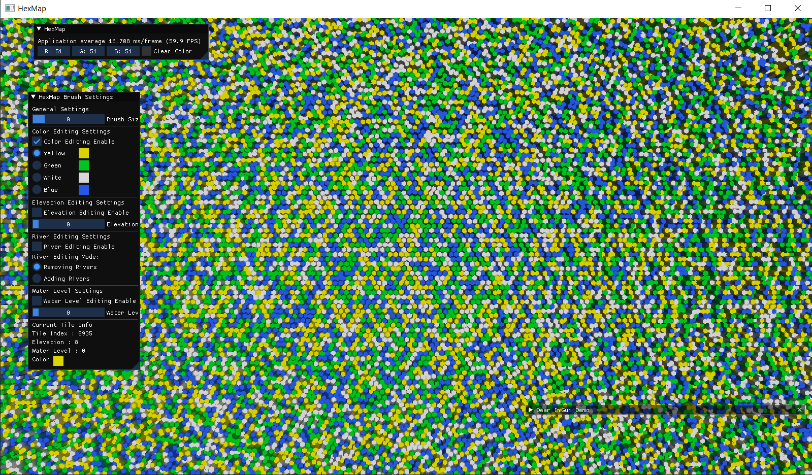

# Nova
Hobby Engine written using C++ for learning purposes. For the moment it only supports OpenGL for Windows and Linux.
## Dependencies
Nova depends on a list of different libraries, these are located in the `Nova/vendor` directory.
 - [ImGui](https://github.com/ocornut/imgui) for GUI Elements
 - [GLFW](https://www.glfw.org/) for platform-independent API for creating windows, contexts and surfaces, reading input, handling events, etc.
 - [glad](https://glad.dav1d.de/) for loading OpenGL 
 - [glm](https://glm.g-truc.net/0.9.9/index.html) for linear algebra and math in general.
 - [spdlog](https://github.com/gabime/spdlog) for Logging
 - [stb\_image](https://github.com/nothings/stb) for reading images from disk
## Compiling Nova and Examples
For generating the project files or makefiles it needs [CMake 3.9+](https://cmake.org/), And OpenGL 4.5+. After generating those files follow the typical workflow to compile with your corresponding development environment (Visual Studio for example).

## Examples
For the moment there is only one example consisting on a port to C++ and OpenGL of this [tutorials](https://catlikecoding.com/unity/tutorials/hex-map/) from Unity: 

